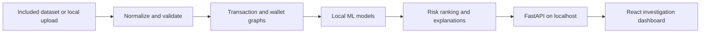

# Bitcoin Transaction Forensics

An offline-first investigation workspace for Bitcoin transaction and network metadata. The project combines a local machine-learning pipeline with an interactive dashboard for reviewing transaction risk, wallet clusters, network connections, and explainable alerts.

Developed for **Smart India Hackathon 2026 — Problem Statement 5**, National Technical Research Organisation (cryptocurrency theme).

> **Offline operation:** The local dashboard, API, dataset, and model run on your computer and make no external network requests at runtime. Internet access is needed once to install dependencies. Keep the local API running while you investigate. A Railway deployment is a hosted demo and requires an internet connection; use the local launcher for an offline presentation.

## What it does

- **Ranked alerts:** combines model signals and graph risk into an ordered list of investigative leads, with evidence and CSV export.
- **Transaction investigation:** inspect transactions and wallets, review risk factors, and follow observed input/output relationships.
- **Network analysis:** explore risk-ranked transaction and wallet networks, expand local connections, and export graph views.
- **Anomaly and pattern analysis:** compare supervised ensemble scores with Isolation Forest results, and inspect mixing and peeling-chain signals.
- **Entity clustering:** group related wallets using common-input heuristics, graph embeddings, and K-Means.
- **Local dataset ingestion:** analyze CSV, JSON, or XML files with field normalization, optional local GeoIP enrichment, and per-browser upload sessions.
- **Offline dashboard shell:** the production service worker caches all built pages and assets on first launch. It can reopen the interface without internet; live analysis uses the local API.

Risk and ownership heuristics are investigative signals, not proof of wrongdoing or control.

## How it works



The pipeline writes its generated model bundle to `artifacts/bundle.joblib`. That file is a local build artifact and is intentionally ignored by Git. If it is missing, it can be regenerated from the included synthetic dataset after installing the project dependencies.

## Technology

| Area | Main tools |
| --- | --- |
| Dashboard | React, TypeScript, Vite, Tailwind CSS |
| API | Python, FastAPI, Uvicorn |
| Data processing | pandas, NumPy, DuckDB |
| Graph analysis | NetworkX, Cytoscape.js |
| Machine learning | scikit-learn, XGBoost, LightGBM |
| Explainability | SHAP |

## Quick start — Windows and VS Code

### Requirements

- Windows 10 or newer
- Python 3.10 or newer (Python 3.11 recommended)
- Node.js 22.12 or newer and npm
- Internet access for the first dependency installation only

Open PowerShell in VS Code and run:

```powershell
git clone https://github.com/Pranjalhiray/AI-Powered-Monitoring-Analysis-of-Bitcoin-Transaction-Traffic.git
cd AI-Powered-Monitoring-Analysis-of-Bitcoin-Transaction-Traffic

python -m venv .venv
.\.venv\Scripts\python.exe -m pip install --upgrade pip
.\.venv\Scripts\python.exe -m pip install -r requirements.txt

Set-Location frontend
npm ci
npm run build
Set-Location ..

.\.venv\Scripts\python.exe src\build_artifacts.py
.\run_local.ps1
```

Open the local address printed in the terminal (usually `http://127.0.0.1:8000`). Leave the terminal running while using the dashboard. If `artifacts/bundle.joblib` already exists, you can skip the model build command.

To use the VS Code task instead, open **Terminal → Run Task… → Run dashboard locally** after setup. For frontend development with hot reload, run `.\run_dev.ps1` from the project root. The development server is intended for editing; use `run_local.ps1` for the production build and service-worker offline cache.

## Linux

```bash
git clone https://github.com/Pranjalhiray/AI-Powered-Monitoring-Analysis-of-Bitcoin-Transaction-Traffic.git
cd AI-Powered-Monitoring-Analysis-of-Bitcoin-Transaction-Traffic
bash setup.sh
bash run.sh
```

Open `http://127.0.0.1:8000`. `setup.sh` installs dependencies, builds the frontend, and creates the model bundle. Run `bash run.sh` for later launches; it does not reinstall packages or retrain existing models.

## Offline use

1. Complete the one-time setup above while dependencies can be installed.
2. Launch with `run_local.ps1` on Windows or `bash run.sh` on Linux.
3. Open the dashboard once and allow the service worker to cache the built interface.
4. Disconnect from the internet if needed. Keep the local dashboard/API process running for analysis.

The static interface and previously loaded reference API responses can be served from the browser cache. Uploads and live analysis still require the local API process. A fresh clone does not contain Python packages, `frontend/node_modules`, the built frontend, or `artifacts/bundle.joblib`; prepare those once before using that clone offline.

## Dashboard pages

| Page | Purpose |
| --- | --- |
| Overview | Dataset summary, headline risk metrics, and transaction patterns |
| Ingest dataset | Import and analyze local CSV, JSON, or XML files |
| Investigate | Review a transaction or wallet with evidence and lineage |
| Ranked alerts | Search, filter, review, and export risk-ranked findings |
| Anomaly detection | View anomaly model metrics and feature signals |
| Entity clusters | Inspect wallet groups and clustering metrics |
| Graph analysis | Explore the risk network or trace observed transaction flows |
| Model performance | Review saved model performance and feature importance |

## Evaluation snapshot

The included dataset is synthetic. These results describe this dataset and should not be treated as real-world performance guarantees.

| Task | Method | Result |
| --- | --- | --- |
| Entity clustering | Union-Find, SVD embeddings, and K-Means | NMI 0.70 |
| Anomaly detection | Isolation Forest | ROC-AUC 0.77 |
| Mixing detection | Random Forest | F1 1.00 |
| Peeling-chain detection | Random Forest and chain walker | F1 0.52 |
| Risk propagation | Personalized PageRank | Wallet ROC-AUC 0.53 |
| Fused risk score | Weighted ensemble | ROC-AUC 0.75 |

Risk propagation and peeling-chain detection are weaker on the included data. The dataset has limited known-risk seed wallets, and an individual peeling hop can resemble an ordinary payment. See [WRITEUP.md](WRITEUP.md) for methodology, evaluation details, and limitations.

## Dataset and limitations

All checked-in transaction and wallet data is synthetic; it contains no real Bitcoin addresses or IP records. The project analyzes imported records and its included dataset—it does not connect to a Bitcoin node or fetch live blockchain data. Field definitions and dataset generation are described in [data/README.md](data/README.md).

- Common-input ownership is only a heuristic and can be unreliable for CoinJoin or mixing transactions.
- Graph embeddings use TruncatedSVD rather than node2vec.
- Each transaction has one observed broadcast, not a full peer-to-peer propagation trace.
- The synthetic data's illicit share is about 21%, far above real-world rates.
- Model outputs are leads for human review, not proof of illicit activity.

## Optional hosted demo

The repository includes a `Dockerfile` for a hosted deployment such as Railway. A hosted copy requires internet access to open and sends uploaded data to the hosting service for processing, so it does not meet the offline/local privacy use case. Use synthetic or non-sensitive data for a public hosted demo; use the local launcher for offline analysis.

## Repository layout

```text
api/main.py              FastAPI endpoints and local static frontend server
src/pipeline.py          Dataset processing, graph construction, models, and risk fusion
src/ingestion.py         Local CSV, JSON, and XML normalization
src/import_analysis.py   Scoring and graph correlation for uploaded data
src/build_artifacts.py   Generate the local model bundle
frontend/                React + TypeScript dashboard
data/                    Included synthetic dataset and documentation
artifacts/               Local generated model bundle (not committed)
run_local.ps1            Windows production launcher
run_dev.ps1              Windows development launcher
setup.sh / run.sh         Linux setup and launch scripts
Dockerfile               Optional hosted deployment image
WRITEUP.md               Technical methodology and evaluation
```

## Acknowledgements

Dataset structure is modeled on the [Elliptic++ transaction graph](https://github.com/git-disl/EllipticPlusPlus) parameters.
