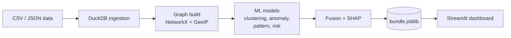

# Bitcoin Transaction Forensics

An offline AI/ML system for monitoring Bitcoin transaction traffic. It ingests bulk transaction and network metadata, links IP addresses, wallets and transactions into a single graph, and produces ranked, explainable alerts through an interactive dashboard.

Built for Smart India Hackathon 2026, Problem Statement 5 (National Technical Research Organisation, Cryptocurrency theme). The system runs entirely on a local Linux machine with no internet access at run time.

## Features

- **Entity clustering.** Groups wallets likely controlled by one entity using the common-input-ownership heuristic combined with graph embeddings.
- **Anomaly detection.** Flags statistically unusual transactions with an Isolation Forest over engineered features.
- **Peeling-chain and mixing detection.** A RandomForest classifier and a graph-based chain walker detect laundering patterns such as peeling chains and CoinJoin-style transactions.
- **Risk scoring.** Personalized PageRank propagates risk from a small set of known illicit wallets across the transaction graph.
- **Explainable alerts.** Every alert has a confidence score, a plain-English reason and a per-transaction SHAP attribution.
- **Link analysis.** Interactive, draggable transaction graphs, fully offline.

## Architecture



Models are trained once by `src/build_artifacts.py` and cached to `artifacts/bundle.joblib`. The dashboard loads that file at startup, so launching it is fast and needs no retraining.

## Tech stack

| Layer            | Tools                                                                                       |
| ---------------- | ------------------------------------------------------------------------------------------- |
| Ingestion        | DuckDB, pandas                                                                              |
| Graph            | NetworkX                                                                                    |
| GeoIP            | geoip2fast (bundled offline database)                                                       |
| Machine learning | scikit-learn (Isolation Forest, RandomForest, K-Means, TruncatedSVD), Personalized PageRank |
| Explainability   | SHAP                                                                                        |
| Dashboard        | Streamlit, Plotly, Pyvis                                                                    |

## Results

Evaluated on the included synthetic dataset against its ground-truth labels.

| Task                    | Method                                  | Result              |
| ----------------------- | --------------------------------------- | ------------------- |
| Entity clustering       | Union-Find + SVD embedding + K-Means    | NMI 0.70            |
| Anomaly detection       | Isolation Forest                        | ROC-AUC 0.77        |
| Mixing detection        | RandomForest                            | F1 1.00             |
| Peeling-chain detection | RandomForest + chain walker             | F1 0.52             |
| Risk propagation        | Personalized PageRank (46 seed wallets) | Wallet ROC-AUC 0.53 |
| Fused risk score        | Weighted ensemble                       | ROC-AUC 0.75        |

Peeling chains and risk propagation are the weakest tasks. A single peeling hop resembles an ordinary payment, and 46 seed wallets carry limited signal. The fused score compensates by combining all signals. See [WRITEUP.md](WRITEUP.md) for the methodology and limitations.

## Getting started

Requires Python 3.10 or newer. Internet access is needed only for the one-time dependency install.

### Linux

```bash
git clone https://github.com/<your-username>/<your-repo>.git
cd <your-repo>
./setup.sh
./run.sh
```

### Windows (PowerShell)

```powershell
python -m venv .venv
.venv\Scripts\Activate.ps1
pip install -r requirements.txt
python src\build_artifacts.py
streamlit run app.py
```

The dashboard opens at `http://localhost:8501`.

## Dashboard pages

| Page                | Description                                                                                                    |
| ------------------- | -------------------------------------------------------------------------------------------------------------- |
| Overview            | Headline metrics, pipeline diagram and a sample of the network and blockchain correlated view                  |
| Investigate         | Drill into any transaction or wallet: risk score, reason, SHAP attribution, raw fields and neighbourhood graph |
| Ranked Alerts       | Filterable alert table with CSV export                                                                         |
| Entity Clusters     | Embedding scatter plot and cluster inspector                                                                   |
| Link-Analysis Graph | Interactive network of the highest-risk transactions                                                           |
| Model Performance   | ROC and PR curves, confusion matrix, feature importance and SHAP summary                                       |

## Project structure

```
.
├── app.py                  Streamlit dashboard
├── src/
│   ├── pipeline.py         Ingestion, graph, models, fusion
│   └── build_artifacts.py  Trains models and writes the cache
├── data/                   Synthetic dataset (see data/README.md)
├── notebooks/              Exploratory notebook
├── .streamlit/config.toml  Dashboard theme
├── requirements.txt
├── setup.sh                One-time setup (Linux)
├── run.sh                  Launch dashboard (Linux)
└── WRITEUP.md              Technical write-up
```

## Dataset

The dataset is fully synthetic and contains no real wallet, IP or transaction data. Field definitions and the generation method are documented in [data/README.md](data/README.md).

## Limitations

- The dataset is synthetic. Its multi-input transactions rarely share an owner, so the common-input heuristic alone recovers little entity structure. The graph embedding recovers most of it.
- Graph embeddings use TruncatedSVD rather than node2vec.
- Each transaction has a single observed broadcast, not a full peer-to-peer propagation trace.
- About 21% of transactions are illicit, far above real-world rates.

## Acknowledgements

Dataset structure is modelled on the [Elliptic++](https://github.com/git-disl/EllipticPlusPlus) transaction graph parameters.
