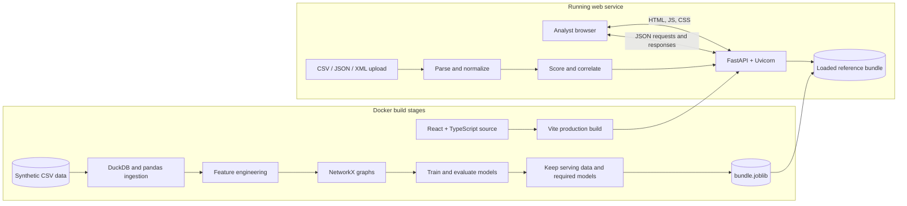
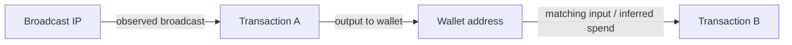
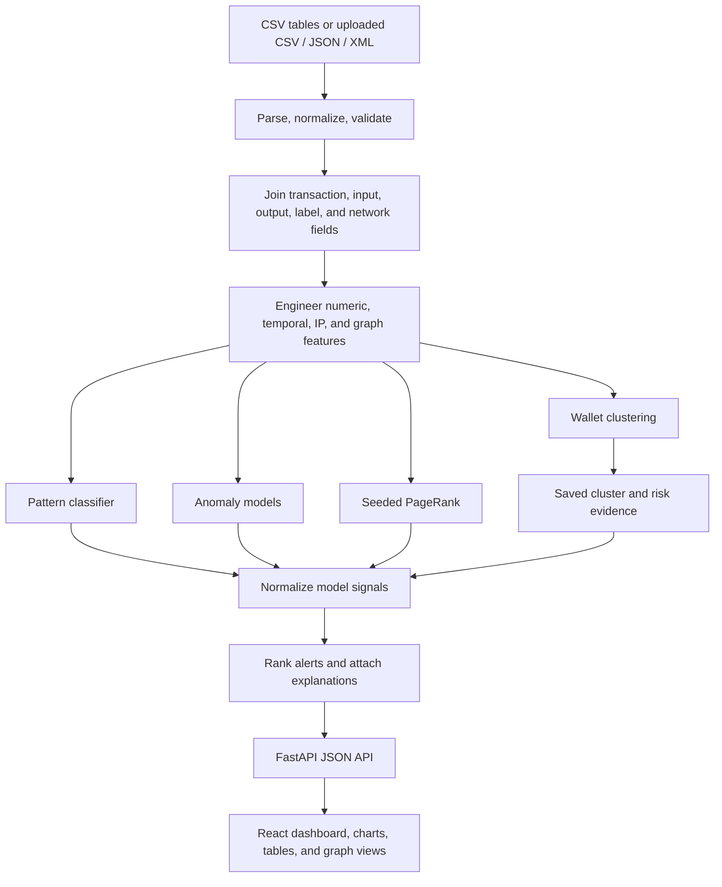

# AI-Powered Bitcoin Transaction Forensics

**An investigation dashboard for synthetic Bitcoin transaction and network-traffic data**
Developed for Smart India Hackathon 2026, Problem Statement 5 (NTRO / Cryptocurrency theme).

> **Scope:** This repository is a research and demonstration prototype. Its bundled data is synthetic; it does not connect to Bitcoin Core, query a blockchain explorer, or monitor live peer-to-peer traffic. A risk score is a way to prioritize records for review, not a probability of guilt or proof of ownership.

**LIVE ON RENDER** - https://teamneotrix.onrender.com
## What the project does

The project joins transaction-flow information with synthetic network metadata, builds transaction and wallet graphs, computes pattern and anomaly signals, and presents ranked records in a browser dashboard. Analysts can inspect transaction inputs and outputs, wallet clusters, nearby graph connections, model metrics, and evidence behind an alert.

The included reference dataset is analyzed while building the model bundle. The API serves the saved predictions and metrics. Users can also upload their own CSV, JSON, or XML transaction records for normalization and scoring against the saved models.

### Main capabilities

- **Overview:** dataset counts, pattern composition, illicit/licit counts, detected chain candidates, and headline model results.
- **Dataset ingestion:** normalize CSV, JSON, or XML records, construct local transaction/wallet flow graphs, and score an imported dataset.
- **Ranked alerts:** filter and sort transaction leads, inspect evidence, and download a CSV.
- **Transaction investigation:** review transaction metadata, inputs, outputs, lineage, scores, and a local neighborhood graph.
- **Wallet investigation:** see wallet risk, cluster assignment, and related transactions.
- **Entity clusters:** inspect embedding-based wallet groups and a two-dimensional projection.
- **Graph analysis:** explore transaction, wallet, and IP links; expand a selected node.
- **Model performance:** view saved ROC/PR curves, confusion matrices, feature importance, and SHAP summaries.

## Project snapshot

Counts below are from the checked-in synthetic dataset and the saved local artifact snapshot.

| Item | Count / value |
| --- | ---: |
| Transactions | 50,000 |
| Wallet addresses | 11,695 |
| Synthetic entities | 3,000 |
| Transaction-to-transaction edges | 90,268 |
| Transaction inputs | 115,236 |
| Transaction outputs | 93,073 |
| Seed wallet addresses | 46 |
| Simulated time steps | 49 |
| Transactions labeled illicit | 21.28% |
| Pattern labels | 41,523 normal · 6,029 peeling-chain · 2,448 mixing |

The high illicit share and repeated pattern signatures are properties of the generated data, not estimates of real Bitcoin activity.

### Dataset files

| File | Contents |
| --- | --- |
| `transactions.csv` | Transaction IDs, simulated time, broadcast IP/ports, and transaction-level values |
| `tx_inputs.csv` / `tx_outputs.csv` | Address and amount rows for each transaction input/output |
| `tx_edges.csv` | Directed parent-to-child transaction flow links |
| `wallets.csv` / `entities.csv` | Synthetic address groups and ground-truth entity metadata |
| `labels.csv` | Synthetic class, illicit, anomaly, and pattern labels |
| `features.csv` | Generated transaction features used by the model pipeline |
| `seed_illicit_wallets.csv` | The 46 synthetic seed addresses for risk propagation |
| `sample_nested.json` | Example nested input/output array representation |

The data generator is `data/generate_dataset.py`. The tables contain generated identifiers and labels; they are not copied from a real blockchain dataset.

## System architecture

The production path is a single Docker web service: FastAPI serves the compiled React application and the JSON API. At startup, the API loads a pruned reference artifact into one Uvicorn worker.



### Transaction graph model

The reference graph contains transaction nodes and directed money-flow edges. Uploaded-data analysis also builds wallet and broadcast-IP nodes. Edges represent observed fields or inferred links from matching records; they do not prove that the same person controlled an address or broadcast a transaction.



## Data and analysis workflow



### Build-time reference-data pipeline

1. `src/build_artifacts.py` reads the versioned synthetic CSV files through DuckDB and pandas.
2. It creates a transaction graph, wallet-to-transaction incidence matrix, and engineered transaction features.
3. It computes wallet clusters, pattern predictions, anomaly scores, PageRank scores, and peeling-chain candidates.
4. It fuses the signals and precomputes metrics and SHAP summaries.
5. It prunes intermediate tables and evaluation-only model objects that the API does not need, while preserving the calibrated anomaly model for upload scoring and the Random Forest used for SHAP.
6. It writes `artifacts/bundle.joblib`. The generated bundle is ignored by Git and rebuilt in the Docker image from `data/`.

### Upload-time workflow

The upload endpoint accepts at most **50 MiB** and **100,000 transaction rows** per file. Field names are normalized through aliases; nested input/output address and amount arrays are supported. The service constructs graphs and features, then uses the saved pattern classifier, calibrated anomaly model, wallet embeddings, and seed-wallet information to score the imported records. Optional local GeoIP enrichment is used only when `geoip2fast` is installed and its data is available.

Upload results are held in process memory under a browser session cookie. The current process permits up to four active sessions and expires an inactive session after four hours. A service restart clears these imported sessions. The service does not persist uploaded files to a database.

## Models and scoring

### Feature groups

The classifier and anomaly models use a mix of:

- **Transaction numeric features:** input/output counts and values, fees, average amounts, fee rate, input/output ratio, retained-value fraction, round-output indicator, and log-transformed input value.
- **Graph features:** transaction in-degree and out-degree, degree ratios, and log-degree values.
- **Network and time features:** time step, observed source-IP reuse, and ASN/geo diversity when available.
- **Wallet embeddings:** 32 components from the wallet-by-transaction incidence matrix for the supervised anomaly model.
- **Categorical fields:** script type and the synthetic source `class` field for anomaly scoring.

### 1. Wallet entity clustering

The pipeline first applies a common-input heuristic with Union-Find, excluding transactions labeled as mixing. It also builds a sparse wallet-by-transaction incidence matrix, projects it to **32 dimensions with TruncatedSVD**, standardizes the embedding, and applies **MiniBatchKMeans** (up to 500 clusters). PCA projects embeddings to two dimensions for the dashboard. The displayed combined cluster ID groups the embedding cluster with the common-input component.

### 2. Transaction-pattern classifier

A **Random Forest classifier** predicts `normal`, `mixing`, or `peeling_chain` from transaction numeric features and graph structure. The current configuration uses 100 trees, maximum depth 12, `min_samples_split = 10`, `min_samples_leaf = 5`, balanced class weights, and a stratified 80/20 train/test split with random state 42.

### 3. Anomaly detection

The supervised model comparison trains **XGBoost**, **LightGBM**, and **Random Forest** models on the synthetic `is_anomaly` label. Their test-set probabilities are averaged for the reported ensemble metrics. An isotonic-calibrated XGBoost model is retained as the primary anomaly scorer for the reference dataset and imported records. An **Isolation Forest** runs as an unsupervised baseline.

The current model configuration uses up to 500 estimators for XGBoost, LightGBM, and the supervised Random Forest; XGBoost uses depth 6 and learning rate 0.05, LightGBM uses depth 6 and early stopping, and the supervised Random Forest uses depth 12 with balanced class weights. The calibrated model uses isotonic calibration with three folds. The Isolation Forest baseline uses 300 estimators on scaled numeric features.

### 4. Seeded risk propagation

A directed transaction-flow graph is scored with Personalized PageRank from transactions associated with **46 seed wallet addresses**, using damping factor `alpha = 0.85`. The current snapshot combines backward and forward propagation with label-measured weights of approximately 0.55 and 0.45, respectively. This result is a weak signal on this dataset and is not used as a standalone decision.

### 5. Peeling-chain candidate detection

A transparent graph walk treats a transaction with exactly two outputs as a peeling-chain candidate and follows unique downstream candidates. Paths must contain at least three transactions. The build snapshot contains **1,825 detected candidate paths**. This is a heuristic count, not a verified count of laundering events; the chain flag adds context and a reason string but is not a separate term in the risk formula.

### 6. Composite risk ranking

Each of the following signals is min-max normalized over the scored dataset:

```text
risk_score = 0.25 × anomaly_score_normalized
           + 0.50 × pattern_illicit_probability_normalized
           + 0.25 × PageRank_risk_normalized
```

The pattern probability is `1 - P(normal)`. The API's `confidence_pct` field is `100 × risk_score`, rounded to one decimal place. It is a **scaled ranking index**, not a calibrated probability of illicit activity. The alert reason may also mention IP/geo signals and peeling-chain membership; those explanations do not change the formula above.

### 7. Explainability

- Each ranked alert includes a readable reason based on the score components and selected feature conditions.
- Per-transaction SHAP explanations use `TreeExplainer` on the pattern Random Forest and explain that classifier's predicted class only.
- The global SHAP summary is precomputed over the 500 highest-ranked reference alerts.
- SHAP does not explain the full three-signal fusion as one model.

## Evaluation snapshot

The following values are read from the saved artifact generated from the included synthetic dataset. The anomaly and pattern classifier numbers use a stratified **20% test split**. These are not real-world Bitcoin performance estimates.


### Anomaly model comparison

| Model | Test ROC-AUC | Test average precision (AP) |
| --- | ---: | ---: |
| XGBoost | 0.9910 | 0.9257 |
| LightGBM | 0.9950 | 0.8847 |
| Random Forest | 0.9939 | 0.9078 |
| Mean of XGBoost + LightGBM + Random Forest | 0.9966 | 0.9220 |
| Isotonic-calibrated XGBoost (primary scoring model) | 0.9852 | 0.9184 |
| Isolation Forest baseline | 0.7557 | 0.0184 |

The mean ensemble metrics describe the three-model comparison on the holdout. The calibrated XGBoost row describes the model used for per-record anomaly scores. Average precision depends on class prevalence; the included anomaly class is synthetic and relatively sparse.

### Pattern classifier results

| True class | Precision | Recall | F1 | Test support |
| --- | ---: | ---: | ---: | ---: |
| Mixing | 1.000 | 1.000 | 1.000 | 490 |
| Normal | 0.987 | 0.759 | 0.858 | 8,304 |
| Peeling chain | 0.360 | 0.931 | 0.519 | 1,206 |
| **Macro average** | **0.782** | **0.897** | **0.792** | **10,000** |

The holdout confusion matrix uses class order `mixing`, `normal`, `peeling_chain`; rows are actual labels and columns are predicted labels.

| Actual / Predicted | Mixing | Normal | Peeling chain |
| --- | ---: | ---: | ---: |
| Mixing | 490 | 0 | 0 |
| Normal | 0 | 6,304 | 2,000 |
| Peeling chain | 0 | 83 | 1,123 |

The low peeling-chain precision reflects many normal records that the classifier flags as peeling-chain-like. This is an important limitation for analyst review.

### Clustering, propagation, and fused-score results

| Evaluation | Result | How to read it |
| --- | ---: | --- |
| Common-input clustering NMI | 0.1274 | Weak agreement with synthetic entity labels |
| SVD embedding clustering NMI | 0.6131 | Better grouping signal on this generated dataset |
| SVD embedding clustering ARI | 0.0344 | Low adjusted pairwise agreement despite the NMI result |
| Embedding homogeneity / completeness | 0.5516 / 0.6900 | Cluster purity and label coverage |
| PageRank transaction ROC-AUC | 0.5259 | Near-random discrimination on this graph |
| PageRank wallet ROC-AUC / AP | 0.5133 / 0.1454 | Weak standalone wallet ranking |
| Fused risk-score ROC-AUC | 0.7802 | **Full-dataset descriptive value, not held-out validation** |

The fused value is computed after the component predictions and risk propagation are generated across the full dataset. It is therefore optimistic as a generalization estimate and should not be compared as if it were an independent test result. The seed propagation weights are also chosen using labels from this synthetic graph.

### SHAP summary snapshot

Mean absolute SHAP values over the top 500 reference alerts, for the pattern Random Forest:

| Feature | Mean absolute SHAP value |
| --- | ---: |
| Number of outputs | 0.1028 |
| Number of inputs | 0.0713 |
| Log transaction out-degree | 0.0620 |
| Transaction out-degree | 0.0513 |
| Input/output ratio | 0.0375 |
| Out-degree / (in-degree + 1) | 0.0311 |
| Source-IP transaction count | 0.0307 |
| In-degree / (out-degree + 1) | 0.0140 |

These values summarize the classifier's explanations on a selected subset; they are not causal effects or whole-system feature importance.

## Dashboard and API

The React single-page application has these routes:

| Frontend route | View |
| --- | --- |
| `/` | Overview |
| `/ingestion` | Dataset upload and imported-data analysis |
| `/investigate` and `/investigate/:txid` | Transaction lookup and investigation |
| `/alerts` | Ranked alerts and export |
| `/anomaly-detection` | Anomaly metrics and signals |
| `/clusters` | Wallet clusters and projection |
| `/graph` | Link analysis and graph expansion |
| `/performance` | Model metrics, curves, and feature importance |

FastAPI also provides interactive API documentation at `/docs` and a health endpoint at `/health`.

<details>
<summary>API endpoint reference</summary>

| Group | Endpoints |
| --- | --- |
| Health | `GET /health` |
| Ingestion | `POST /api/ingestion/analyze`, `GET /api/ingestion/session`, `GET /api/ingestion/alerts`, `GET /api/ingestion/graph`, `DELETE /api/ingestion/session` |
| Overview | `GET /api/overview/stats`, `/api/overview/correlated-sample`, `/api/overview/pattern-composition`, `/api/overview/illicit-vs-licit`, `/api/overview/focus-areas` |
| Investigation | `GET /api/investigate/transaction/{txid}`, `/api/investigate/wallet/{address}`, `/api/investigate/transaction/{txid}/graph`, `/api/graph/trace/{txid}`, `/api/investigate/transaction/{txid}/shap` |
| Alerts | `GET /api/alerts/ranked`, `GET /api/alerts/download` |
| Graph | `GET /api/graph/link-analysis`, `GET /api/graph/expand` |
| Clusters | `GET /api/clusters/metrics`, `/api/clusters/embeddings`, `/api/clusters/ids`, `/api/clusters/{cluster_id}` |
| Performance | `GET /api/performance/anomaly`, `/api/performance/anomaly/supervised`, `/api/performance/pattern`, `/api/performance/risk`, `/api/performance/ensemble`, `/api/performance/risk-distribution`, `/api/performance/shap-global` |

</details>

## Technology stack

| Layer | Technologies | Role |
| --- | --- | --- |
| Frontend | React 19, TypeScript, Vite, Tailwind CSS | Dashboard and client-side routing |
| Frontend data/state | TanStack React Query, Zustand | API queries, caching, and UI state |
| Charts and graphs | Chart.js, Cytoscape.js | Metrics visualizations and interactive graphs |
| API/server | Python 3.11, FastAPI, Uvicorn | REST endpoints and static SPA hosting |
| Data processing | pandas, NumPy, DuckDB, SciPy | CSV ingestion, tabular transformations, sparse matrices |
| Graph algorithms | NetworkX | Transaction lineage, PageRank, chain walks |
| Machine learning | scikit-learn, XGBoost, LightGBM | Clustering, classification, anomaly scoring |
| Explainability | SHAP | Pattern-classifier explanations |
| Packaging | Docker multi-stage build | Build frontend and artifact, then copy runtime files into final image |

The active app is the React/FastAPI service in `frontend/` and `api/main.py`. The repository also contains older prototype material that refers to Streamlit; it is not the Docker service entry point.

## Run locally

### Requirements

- Python 3.11 recommended
- Node.js 22 and npm
- Windows PowerShell or Linux/macOS shell
- Internet access for the initial package install and frontend build

### Windows PowerShell

From the repository root:

```powershell
python -m venv .venv
.\.venv\Scripts\python.exe -m pip install --upgrade pip
.\.venv\Scripts\python.exe -m pip install -r requirements-api.txt

Set-Location frontend
npm ci
npm run build
Set-Location ..

.\.venv\Scripts\python.exe src\build_artifacts.py
.\run_local.ps1
```

Open the local URL printed by the launcher, usually `http://127.0.0.1:8000`. The artifact build trains the models and can take longer than a normal app launch. After a successful build, `run_local.ps1` reuses the generated artifact. Keep the process running while using the dashboard.

### Linux

```bash
python3 -m venv .venv
source .venv/bin/activate
python -m pip install --upgrade pip
python -m pip install -r requirements-api.txt
(cd frontend && npm ci && npm run build)
python src/build_artifacts.py
bash run.sh
```

For frontend development with hot reload, use `run_dev.ps1` on Windows or `npm run dev` from `frontend/`; run the API separately. `setup.sh` installs the broader `requirements.txt`, which also includes dependencies from the earlier Streamlit prototype.

## Reproducibility and data provenance

The saved artifact uses random state 42 for the principal clustering and train/test split steps. Rebuilding from the checked-in data reruns preprocessing and training, so library-version changes can produce small metric differences. The generated files under `artifacts/` are intentionally not committed; the Docker build creates them from `data/`.

The dataset structure is inspired by the transaction-graph format used by [Elliptic++](https://github.com/git-disl/EllipticPlusPlus). The repository's included records are generated locally and are not the Elliptic++ dataset.
